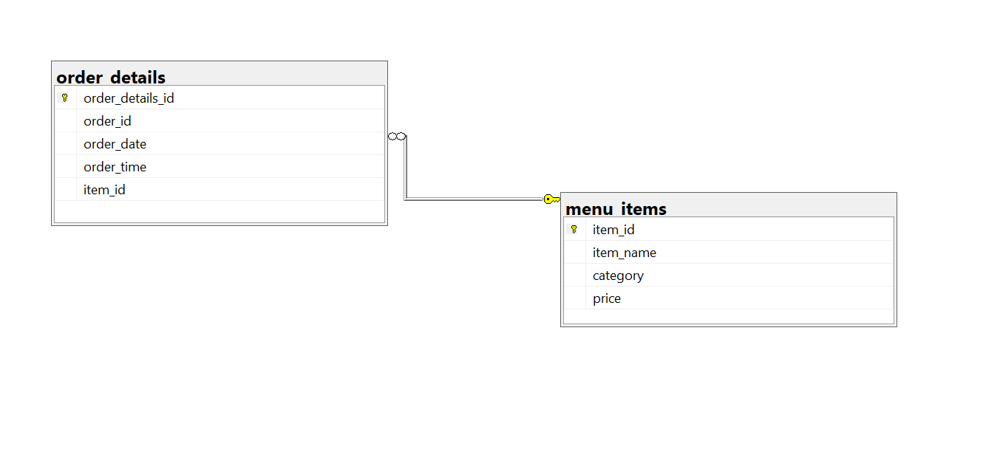

# Restaurant Orders

## Introduction
A SQL and POWER BI project that analyzes A quarter's worth of orders from a restaurant serving international cuisine, including the date and time of each order, the items ordered, and additional details on the type, name and price of the items.
## Table Of Content
- [Introduction](https://github.com/teejay-tems/Maven-Restaurant-Orders#introduction)
- [Project Overview](https://github.com/teejay-tems/Maven-Restaurant-Orders#project-overview)
- [Project Scope](https://github.com/teejay-tems/Maven-Restaurant-Orders#project-scope)
- [Business Objective](https://github.com/teejay-tems/Maven-Restaurant-Orders#business-objectives)
- [Document Purpose](https://github.com/teejay-tems/Maven-Restaurant-Orders#document-purpose)
- [Use Case](https://github.com/teejay-tems/Maven-Restaurant-Orders#use-case)
- [Skills Demonstrated](https://github.com/teejay-tems/Maven-Restaurant-Orders#skills-demonstrated)
- [Data Source](https://github.com/teejay-tems/Maven-Restaurant-Orders#data-source)
- [Data Cleaning and Processing](https://github.com/teejay-tems/Maven-Restaurant-Orders#data-cleaning-and-processing)
- [Data Analysis and Insight](https://github.com/teejay-tems/Maven-Restaurant-Orders#data-analysis-and-insights)
- [Data Visualization](https://github.com/teejay-tems/Maven-Restaurant-Orders#data-visualization)
- [Recommendation](https://github.com/teejay-tems/Maven-Restaurant-Orders#recommendations)
- [Conclusion](https://github.com/teejay-tems/Maven-Restaurant-Orders#conclusion)

## Project Overview   
This project evaluates a restaurant menu order and provides insights derived from the order sales analysis into the various product profitable, sales performance trends, the least and most ordered items.     

The project will provide the restaurant with the knowledge needed to make informed decisions and pinpoint important areas in need of enhancement and optimization.

## Project Scope
This project used MSSQL server to analyze a restaurant dataset with more than 12266 records. It focuses on the relationship between the menu and order table. The analysis covers data from January 1, 2023, to March 31,2023 to provide a comprehensive view of the restaurant operational performance and identify the most and least order ordered items, their different categories, total order amount, maximum amount spent by Top orders and to identify customer behaviors.

## Business Objectives
The primary business objective of the "Restaurant Menu Order Analysis" project is to maximize profitability and enhance customer satisfaction of the restaurant. This will be achieved by leveraging data-driven insights from a comprehensive analysis of the restaurant's order data. The specific goals include.

- **Improve Operational Efficiency:** Use insights from the data analysis to streamline kitchen operations, reduce wait times, manage inventory more effectively, and - minimize waste, resulting in a better customer experience and lower operational costs.
  
- **Determine High-Selling Menu Items:** Determine which items on the menu are the most profitable and popular among customers to ensure they remain a staple of the restaurant's offerings.
  
- **Optimize Menu Offerings:** Adjust the menu by modifying, adding, or removing items based on their performance metrics to better align with customer preferences and improve overall sales.
  
- **Understand Sales Performance Trends:** Analyze sales data to identify peak ordering times, seasonal trends, and category performance, enabling the restaurant to make informed decisions about staffing, inventory management, and marketing strategies.

## Document Purpose
This documentation serves as a guide for project stakeholders, providing insights into the project's objectives, data sources, data analysis, and any other relevant information.
## Use Case
The insights gained from the **"Restaurant Menu Order Analysis"** is intended for the following stakeholders.

**1.  Restaurant Owner/Management:** Management can use this analysis to support strategic choices about menu options and operational upgrades.  And, to provide a comprehensive overview of the restaurant's sales performance and profitability.

**2.  Investors/Stakeholders:** By providing transparency regarding the restaurant's financial performance and growth opportunities. 

**3.  Chef/Kitchen Staff:**  Based on the analysis chefs are informed about which menu items are most and least popular among customers and provide adjustments in recipes and preparation methods to enhance profitability and customer satisfaction.

**4.  Data Analyst:** To ensure alignment with the business objectives and facilitate ongoing analysis and reporting. 

**5.  Marketing Team:** By utilizing the analysis, marketing teams should develop targeted promotional strategies based on insights from the sales analysis and introduce new or improved menu items.

## Skills Demonstrated
- Data Connection in Microsoft SQL Server
- Data Cleaning and Processing with SQL Server
- Developed a Database Schema
- Data Analysis with SQL Server
- Join
- CTE (Common Table Expression)
- Data Connection in Power BI with SQL Server
- Data Visualization with Power BI

## Data Source
The project utilizes a dataset containing information on menus and order details. The dataset used for this analysis was downloaded from [Maven Analytics](https://mavenanalytics.io/data-playground?page=4&pageSize=5) website where datasets are available for practice purposes. The dataset is a CSV file, and it consists of two main tables which are menu table, and order table. 
The Menu table has 32 rows and 4 columns, it contains information about the Item name, the menu category or type of cuisine and the Price.
The order details table has 12234 rows and 5 columns, it contains details about the order id, the date and time an order was put in.

The analysis of this dataset aims to extract actionable insights that will help optimize the restaurant’s menu, enhance sales performance, and improve operational efficiency. The ultimate objective is to equip the restaurant with the necessary knowledge to make informed decisions, thereby increasing profitability and customer satisfaction.

## Data Cleaning and Processing
Data cleaning is essential because the accuracy and reliability of input data significantly impacts the quality of analysis and the insights derived from it. Incomplete or inconsistent data can lead to inaccurate conclusions and complicates decision-making processes. By meticulously cleaning and preparing the data, I ensure that my analyses are based on a solid foundation, resulting in more dependable outcomes and well-informed decisions. This thorough data preparation process helps to enhance the overall quality and credibility of the project's insights and recommendations.
For each table used in the analysis, extensive data cleaning procedures were carried out to ensure high data accuracy, integrity, and quality. The following steps were taken for each table.

**1.  Data Validation:**
- Verified that all columns (Item Name, Menu Category, Price, Order ID, Date, Time) contain appropriate data types (e.g., text for names and categories, numeric for prices, and order IDs, and date format for Date, time format for Time).
- Checked for any missing or null values and addressed them appropriately (e.g., filling in missing data or removing incomplete records).

**2.  Standardization:**
- Ensured consistent naming conventions for item name and categories in the menu item tables.
- Standardized price formats (e.g., ensuring all prices are in the same currency (USD) format).
  
**3.  Duplicate Removal:**
- To preserve data integrity and avoid skewed analysis results.
  
**4.  Outlier Detection:**
- I checked for any price outliers in the price column that might indicate data entry errors. The analysis showed that the minimum price is $5, and the maximum price is $20 for the items ordered, indicating that there are no outliers.

**5. Added a new column:**
A new column called "Hour" was added to the order table, calculating the time of the day that had more orders and less orders.  This column is essential for determining the hour in the day that yield more sales and which item in the menu is ordered most, this analysis offers insightful information about the most lucrative product categories.

## Established Relationships Between Tables.
Establishing a relationship between the menu_items table and the order_details table is essential for organizing and managing the database efficiently. This relationship typically involves using foreign keys to connect related data across tables. 

**Importance of Establishing the Relationships**

**_1. Data Integrity:_** Establishing a foreign key relationship ensures that the item_id in the order_details table must correspond to a valid item_id in the menu_items table. it prevents invalid data from being inserted.

**_2. Efficient Data Retrieval:_** With the relationship established, one can use JOIN operations to efficiently retrieve related data from both tables in a single query. For example, writing a sql syntax that can join the order_details table with the menu_items table to get detailed information about the items in each order.

**_3. Avoid Data Duplication:_** By referencing the menu_items table in the order_details table, you avoid duplicating item information. Each item’s details are stored once in the menu_items table and referenced as needed in the order_details table.

**_4. Simplified Maintenance:_** Having a clear relationship between tables makes it easier to maintain the database. Updates to item details need to be made in only one place (the menu_items table), and those changes will automatically be reflected in any related orders.

For the complete data cleaning documentation   

## Data Analysis and Insights
This project aims to analyze sales data to identify peak ordering times and seasonal trends. Evaluate the profit margins for each item and identify the most profitable dishes and drinks.
In addition, to assess the popularity of the different item categories (e.g., appetizers, main courses, desserts, beverages) over the quarter. Provide recommendations for menu adjustments based on item popularity and profitability.

This analysis will provide answers to the following questions.

**1.	What were the least and most ordered items? What categories were they in?**

**2.	What do the highest spend orders look like? Which items did they buy and how much did they spend?**

**3.	Were there certain times that had more or less orders?**

**4.	Which cuisines should we focus on developing more menu items for based on the data?**

## Data Visualization
This data visualization was created using Power BI, each visual created displays information for each question in the business objective.
You can interact with the [_**report here**_]()

## Recommendations
**1.	Menu Optimization**
- It helps to highlight high-performing items to ensure they remain a staple on the menu.
- Management should consider removing or modifying low-performing items to improve overall sales and customer satisfaction.
  
**2.	Promotional Strategies**
- Develop targeted promotions for popular items to boost sales during off-peak times.
- Introduce limited time offers for new or underperforming items to gauge customer interest.
  
**3.	Operational Improvements**
- Streamline kitchen operations based on peak ordering times to reduce wait times and improve service efficiency.
- Adjusting inventory management practices to minimize waste and ensure the availability of popular items.

## Conclusion
By analyzing the restaurant's order data, this project provides actionable insights that can help enhance menu offerings, optimize sales strategies, and improve overall operational efficiency. The recommendations derived from this analysis aim to drive profitability and ensure a better dining experience for customers.

